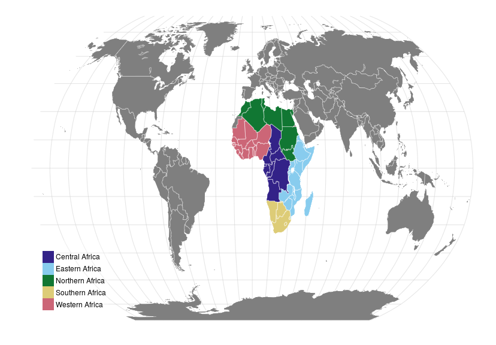

#  Africa

## Map

 

<!-- html table generated in R 3.2.2 by xtable 1.7-4 package -->
<!-- Fri Oct 30 13:15:42 2015 -->
<table class="table table-striped table-hover">
<tr> <th> Central Africa </th> <th> Eastern Africa </th> <th> Northern Africa </th> <th> Southern Africa </th> <th> Western Africa </th>  </tr>
 <tr> <td> Angola </td> <td> Burundi </td> <td> Algeria </td> <td> Botswana </td> <td> Benin </td> </tr>
  <tr> <td> Cameroon </td> <td> Djibouti </td> <td> Egypt </td> <td> Lesotho </td> <td> Burkina Faso </td> </tr>
  <tr> <td> Central African
Republic </td> <td> Eritrea </td> <td> Libya </td> <td> Namibia </td> <td> Côte d'Ivoire </td> </tr>
  <tr> <td> Chad </td> <td> Ethiopia </td> <td> Morocco </td> <td> South Africa </td> <td> Gambia </td> </tr>
  <tr> <td> Congo </td> <td> Kenya </td> <td> South Sudan </td> <td> Swaziland </td> <td> Ghana </td> </tr>
  <tr> <td> DR Congo </td> <td> Madagascar </td> <td> Sudan </td> <td>  </td> <td> Guinea </td> </tr>
  <tr> <td> Equatorial Guinea </td> <td> Malawi </td> <td> Tunisia </td> <td>  </td> <td> Guinea-Bissau </td> </tr>
  <tr> <td> Gabon </td> <td> Mauritius </td> <td>  </td> <td>  </td> <td> Liberia </td> </tr>
  <tr> <td>  </td> <td> Mozambique </td> <td>  </td> <td>  </td> <td> Mali </td> </tr>
  <tr> <td>  </td> <td> Rwanda </td> <td>  </td> <td>  </td> <td> Mauritania </td> </tr>
  <tr> <td>  </td> <td> Somalia </td> <td>  </td> <td>  </td> <td> Niger </td> </tr>
  <tr> <td>  </td> <td> Tanzania </td> <td>  </td> <td>  </td> <td> Nigeria </td> </tr>
  <tr> <td>  </td> <td> Uganda </td> <td>  </td> <td>  </td> <td> Senegal </td> </tr>
  <tr> <td>  </td> <td> Zambia </td> <td>  </td> <td>  </td> <td> Sierra Leone </td> </tr>
  <tr> <td>  </td> <td> Zimbabwe </td> <td>  </td> <td>  </td> <td> Togo </td> </tr>
  </table>

