#  Africa

<!-- %
% PPPPPPPPPPPPPPPPP                                               tttt             444444444
% P::::::::::::::::P                                           ttt:::t            4::::::::4
% P::::::PPPPPP:::::P                                          t:::::t           4:::::::::4
% PP:::::P     P:::::P                                         t:::::t          4::::44::::4
%   P::::P     P:::::Paaaaaaaaaaaaa  rrrrr   rrrrrrrrr   ttttttt:::::ttttttt   4::::4 4::::4
%   P::::P     P:::::Pa::::::::::::a r::::rrr:::::::::r  t:::::::::::::::::t  4::::4  4::::4
%   P::::PPPPPP:::::P aaaaaaaaa:::::ar:::::::::::::::::r t:::::::::::::::::t 4::::4   4::::4
%   P:::::::::::::PP           a::::arr::::::rrrrr::::::rtttttt:::::::tttttt4::::444444::::444
%   P::::PPPPPPPPP      aaaaaaa:::::a r:::::r     r:::::r      t:::::t      4::::::::::::::::4
%   P::::P            aa::::::::::::a r:::::r     rrrrrrr      t:::::t      4444444444:::::444
%   P::::P           a::::aaaa::::::a r:::::r                  t:::::t                4::::4
%   P::::P          a::::a    a:::::a r:::::r                  t:::::t    tttttt      4::::4
% PP::::::PP        a::::a    a:::::a r:::::r                  t::::::tttt:::::t      4::::4
% P::::::::P        a:::::aaaa::::::a r:::::r                  tt::::::::::::::t    44::::::44
% P::::::::P         a::::::::::aa:::ar:::::r                    tt:::::::::::tt    4::::::::4
% PPPPPPPPPP          aaaaaaaaaa  aaaarrrrrrr                      ttttttttttt      4444444444
%
%

%%%%%%%%%%%%%%%%%%%%%%%%%%%%%%%%%%%%%%%%%%%%%%%%%%
%% PART4 - Sustainability dimensions
%%%%%%%%%%%%%%%%%%%%%%%%%%%%%%%%%%%%%%%%%%%%%%%%%% -->

<!-- %
%   _                       _
%  | |     __ _  _ __    __| |
%  | |    / _` || '_ \  / _` |
%  | |___| (_| || | | || (_| |
%  |_____|\__,_||_| |_| \__,_|
%
% -->

<h1> Land </h1> 

Land is necessary for sustainable agricultural development, essential ecosystem functions and food security. More than 1.5 billion hectares – about 12 percent of the world’s land area – are used for crop production. Although large amounts of land are potentially suitable for agriculture, much of it is covered by forests, protected for environmental reasons or are part of urban areas. Some 90 percent of agricultural land is in Latin America and sub-Saharan Africa. At the other extreme, there is almost none available for agricultural expansion in Southern Asia, the Western Asia and Northern Africa.
 

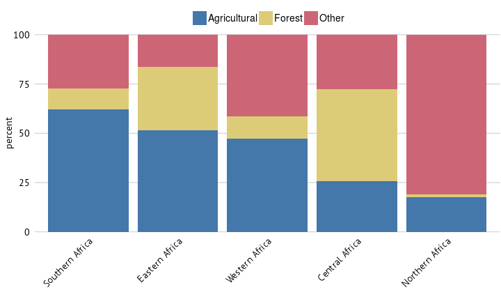   
Land area

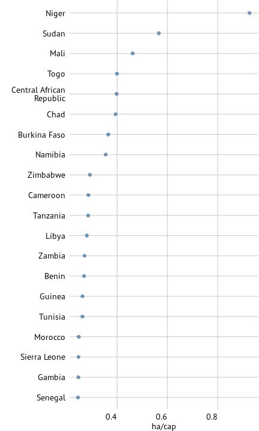   
Arable land per capita, top 20 African countries

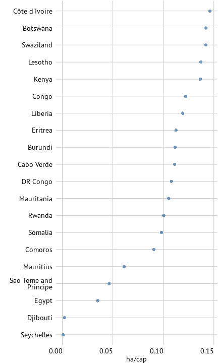   
Arable land per capita, bottom 20 African countries

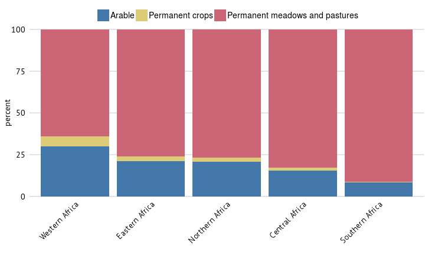   
Agricultural area

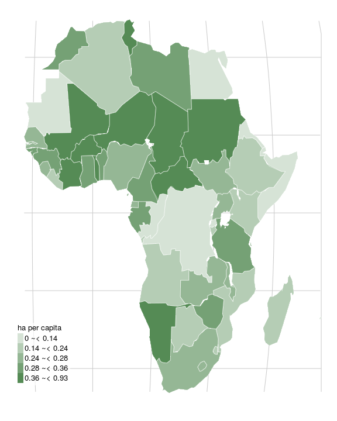   
Cropland per capita, ha/cap

<!-- %
%  __        __          _
%  \ \      / /   __ _  | |_    ___   _ __
%   \ \ /\ / /   / _` | | __|  / _ \ | '__|
%    \ V  V /   | (_| | | |_  |  __/ | |
%     \_/\_/     \__,_|  \__|  \___| |_|
% -->

<h1> Water </h1> 

Global demand for water has risen sharply over the last century. Total annual water withdrawal from agriculture, municipalities and industries rose from less than 580 km\textsuperscript{3} in 1900 to more than 3 900 km\textsuperscript{3} in 2010. Agriculture accounts for approximately 70 percent of total freshwater withdrawal in the world, mostly through irrigation. This has been crucial for gains in food production since irrigation reduces drought risk and encourages crop diversification, thus also enhancing rural incomes. While irrigated agriculture represents about 20 percent of the cultivated land, it contributes to 40 percent of global food production.
 

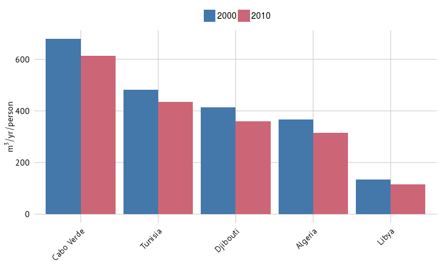   
Countries with the lowest renewable water resources per capita

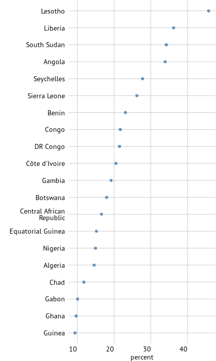   
Freshwater withdrawal by industrial sector, share of total, highest 20 (1999 to 2013)

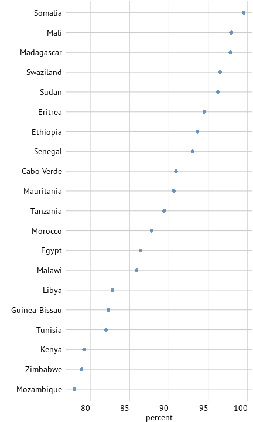   
Freshwater withdrawal by agricultural sector, share of total, highest 20 (1999 to 2013)

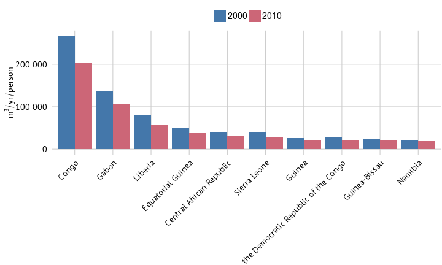   
Countries with the lowest renewable water resources per capita

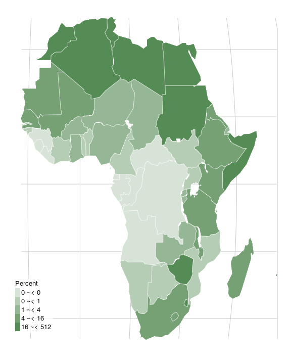   
Freshwater resources withdrawn by agriculture (percent, 1999-2013*)

<!-- %   _____
%  | ____|  _ __     ___   _ __    __ _   _   _
%  |  _|   | '_ \   / _ \ | '__|  / _` | | | | |
%  | |___  | | | | |  __/ | |    | (_| | | |_| |
%  |_____| |_| |_|  \___| |_|     \__, |  \__, |
%                                 |___/   |___/ -->

<h1> Energy </h1> 

Energy is an important input for the agri-food chain and is used to power agricultural machinery, heat greenhouses, power irrigation systems, but also to manufacture equipment, fertilizers, pesticides and other agro-chemicals. The amount of energy consumed by agriculture is increasing worldwide as mechanization, especially in developing countries, increases. At the same time agriculture produces energy in the form of bioenergy. Bioenergy production increased sharply over the last years to meet the new demand for liquid biofuels for transport (e.g., ethanol and biodiesel) and solid biomass for power such as pellets or wood chips.
 

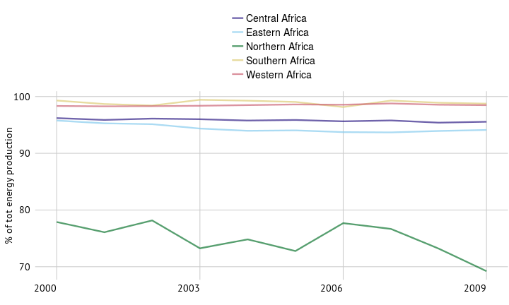   
Bioenergy production, share of total energy production

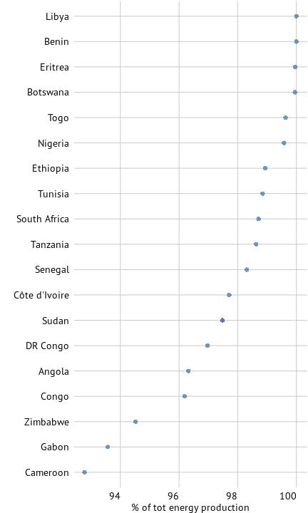   
Bioenergy production, share of total energy production, top 20 countries 2009

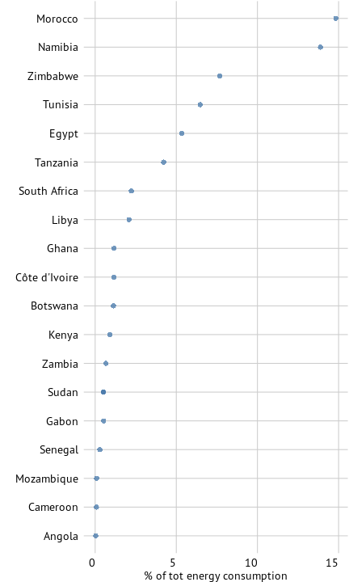   
Energy use in agriculture and forestry, share of total energy consumption, top 20 countries 2009

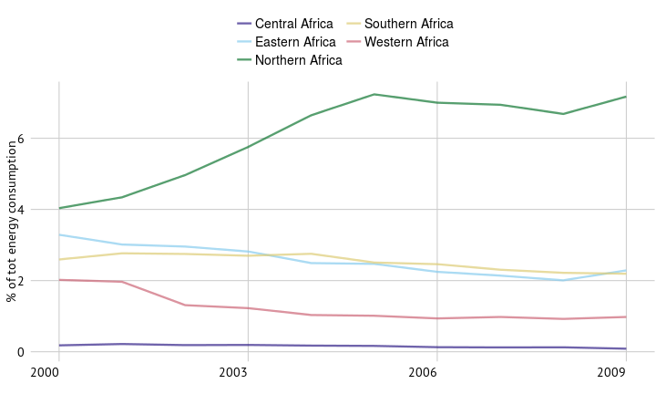   
Energy use in agriculture and forestry, share of total energy consumption

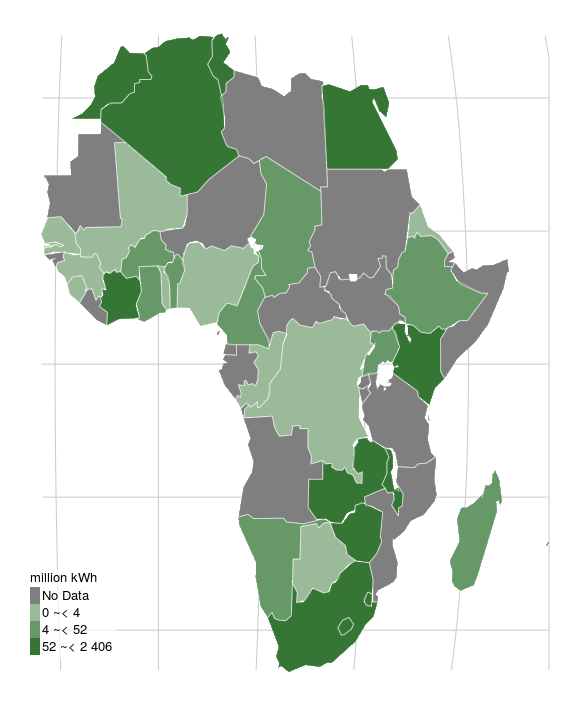   
Energy consumption for power irrigation, million kWh (2008-2011*)

<!-- %   _____                               _
%  |  ___|   ___    _ __    ___   ___  | |_   _ __   _   _
%  | |_     / _ \  | '__|  / _ \ / __| | __| | '__| | | | |
%  |  _|   | (_) | | |    |  __/ \__ \ | |_  | |    | |_| |
%  |_|      \___/  |_|     \___| |___/  \__| |_|     \__, |
%                                                    |___/ -->

<h1> Forestry </h1> 

Forests make vital contributions to biodiversity. They also sustain a range of economic activities and act as a source of food, medicine and fuel for more than a billion people. The latest estimate of the world’s total forest area is more than 4 billion hectares, corresponding to about 30 percent of total land area. But today forests face unprecedented pressures. Changes in land cover have caused the most pressing environmental issue in recent decades. The impact of deforestation and land use intensification, especially on soil degradation, have been significant.
 

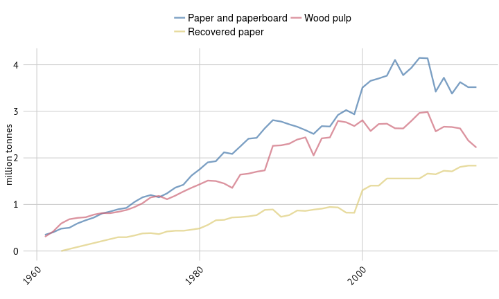   
Production of selected forest products

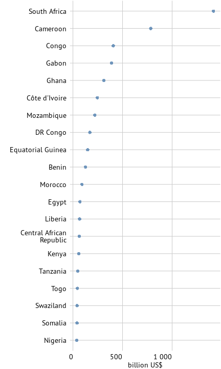   
Top 20 exporters of forest products (2012)

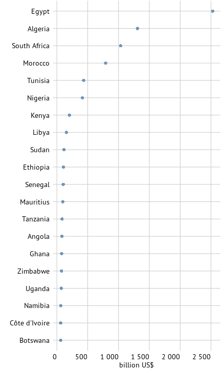   
Top 20 importers of forest products (2012)

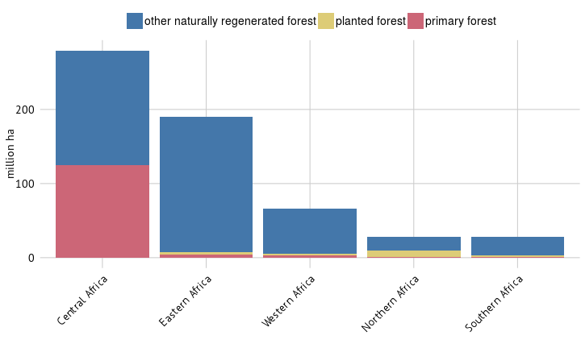   
Forest characteristics (2015)

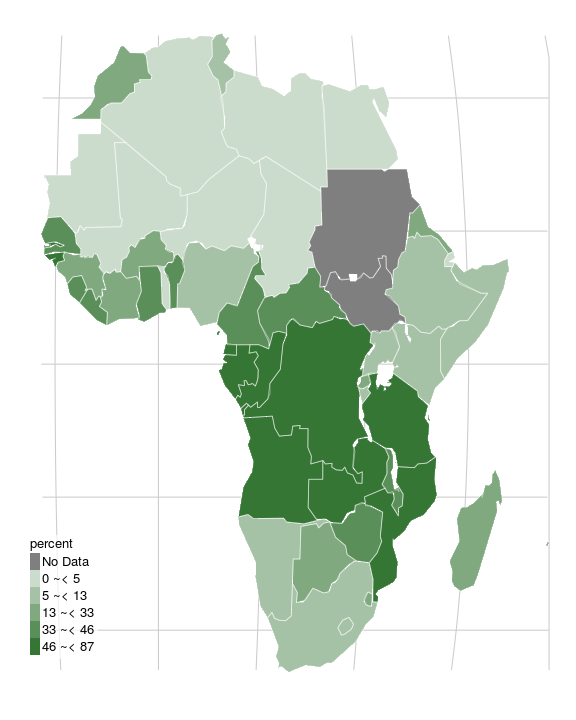   
Forest area as share of total land area, percent (2012)

<!-- %    ____   _   _                       _                     _
%   / ___| | | (_)  _ __ ___     __ _  | |_    ___      ___  | |__     __ _   _ __     __ _    ___
%  | |     | | | | | '_ ` _ \   / _` | | __|  / _ \    / __| | '_ \   / _` | | '_ \   / _` |  / _ \
%  | |___  | | | | | | | | | | | (_| | | |_  |  __/   | (__  | | | | | (_| | | | | | | (_| | |  __/
%   \____| |_| |_| |_| |_| |_|  \__,_|  \__|  \___|    \___| |_| |_|  \__,_| |_| |_|  \__, |  \___|
%                                                                                     |___/ -->

<h1> Climate change </h1> 

The severity and speed of climate change is presenting an unprecedented challenge. Current global surface temperatures are now about 0.6 degrees Celsius higher than the average for the last century. This increase is consistent with model predictions of the effects of rising atmospheric concentrations of carbon dioxide (CO\textsubscript{2}) and other GHGs, which are a result of human activity. The poorest and most food-insecure regions around the globe are the most vulnerable. Already scarce land and water resources will likely become even more scarce, and insufficient technical and financial means will make adaptation to a changing climate very difficult.
 

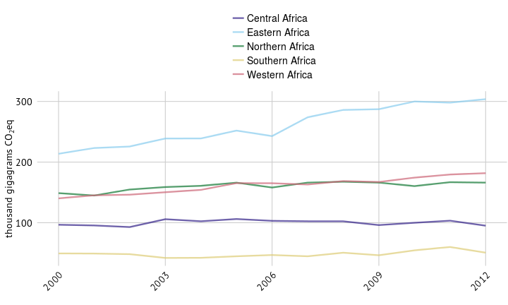   
Greenhouse gas emissions in agriculture

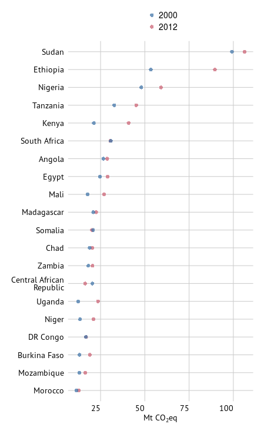   
Greehouse gas emissions in agriculture, highest 20 countries in 2012

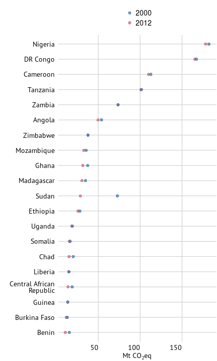   
Land use total emissions, highest 20 countries in 2012

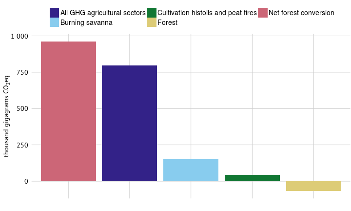   
Emissions by subsectors in 2012 - figure differs, check!!

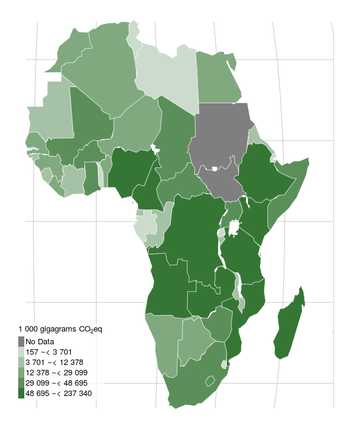   
Total greenhouse gas emissions from agriculture, forestry and other land use, gigagrams CO\textsubscript{2} eq (2012)

