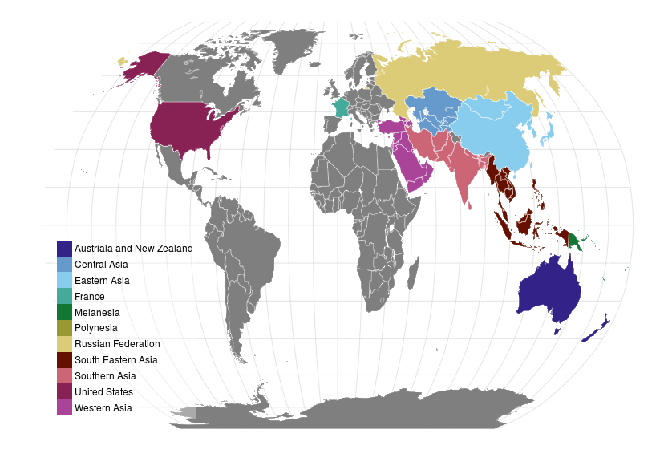

#  Asia and the Pacific

## Map

 

<!-- html table generated in R 3.2.2 by xtable 1.7-4 package -->
<!-- Fri Oct 30 13:14:54 2015 -->
<table class="table table-striped table-hover">
<tr> <th> Austriala and New Zealand </th> <th> Central Asia </th> <th> Eastern Asia </th> <th> France </th> <th> Melanesia </th> <th> Polynesia </th> <th> Russian Federation </th> <th> South Eastern Asia </th> <th> Southern Asia </th> <th> United States </th> <th> Western Asia </th>  </tr>
 <tr> <td> Australia </td> <td> Kazakhstan </td> <td> China </td> <td> France </td> <td> Fiji </td> <td> Samoa </td> <td> Russian Federation </td> <td> Brunei Darussalam </td> <td> Afghanistan </td> <td> United States
of America </td> <td> Armenia </td> </tr>
  <tr> <td> New Zealand </td> <td> Kyrgyzstan </td> <td> Japan </td> <td>  </td> <td> New Caledonia </td> <td>  </td> <td>  </td> <td> Cambodia </td> <td> Bangladesh </td> <td>  </td> <td> Azerbaijan </td> </tr>
  <tr> <td>  </td> <td> Tajikistan </td> <td> Korea, Dem Rep </td> <td>  </td> <td> Papua New
Guinea </td> <td>  </td> <td>  </td> <td> Indonesia </td> <td> Bhutan </td> <td>  </td> <td> Cyprus </td> </tr>
  <tr> <td>  </td> <td> Turkmenistan </td> <td> Mongolia </td> <td>  </td> <td> Solomon Islands </td> <td>  </td> <td>  </td> <td> Laos </td> <td> India </td> <td>  </td> <td> Georgia </td> </tr>
  <tr> <td>  </td> <td> Uzbekistan </td> <td> Republic of Korea </td> <td>  </td> <td> Vanuatu </td> <td>  </td> <td>  </td> <td> Malaysia </td> <td> Iran
(Islamic Republic of) </td> <td>  </td> <td> Iraq </td> </tr>
  <tr> <td>  </td> <td>  </td> <td>  </td> <td>  </td> <td>  </td> <td>  </td> <td>  </td> <td> Myanmar </td> <td> Nepal </td> <td>  </td> <td> Israel </td> </tr>
  <tr> <td>  </td> <td>  </td> <td>  </td> <td>  </td> <td>  </td> <td>  </td> <td>  </td> <td> Philippines </td> <td> Pakistan </td> <td>  </td> <td> Jordan </td> </tr>
  <tr> <td>  </td> <td>  </td> <td>  </td> <td>  </td> <td>  </td> <td>  </td> <td>  </td> <td> Thailand </td> <td> Sri Lanka </td> <td>  </td> <td> Kuwait </td> </tr>
  <tr> <td>  </td> <td>  </td> <td>  </td> <td>  </td> <td>  </td> <td>  </td> <td>  </td> <td> Timor-Leste </td> <td>  </td> <td>  </td> <td> Lebanon </td> </tr>
  <tr> <td>  </td> <td>  </td> <td>  </td> <td>  </td> <td>  </td> <td>  </td> <td>  </td> <td> Viet Nam </td> <td>  </td> <td>  </td> <td> Oman </td> </tr>
  <tr> <td>  </td> <td>  </td> <td>  </td> <td>  </td> <td>  </td> <td>  </td> <td>  </td> <td>  </td> <td>  </td> <td>  </td> <td> Qatar </td> </tr>
  <tr> <td>  </td> <td>  </td> <td>  </td> <td>  </td> <td>  </td> <td>  </td> <td>  </td> <td>  </td> <td>  </td> <td>  </td> <td> Saudi Arabia </td> </tr>
  <tr> <td>  </td> <td>  </td> <td>  </td> <td>  </td> <td>  </td> <td>  </td> <td>  </td> <td>  </td> <td>  </td> <td>  </td> <td> Syria </td> </tr>
  <tr> <td>  </td> <td>  </td> <td>  </td> <td>  </td> <td>  </td> <td>  </td> <td>  </td> <td>  </td> <td>  </td> <td>  </td> <td> Turkey </td> </tr>
  <tr> <td>  </td> <td>  </td> <td>  </td> <td>  </td> <td>  </td> <td>  </td> <td>  </td> <td>  </td> <td>  </td> <td>  </td> <td> United Arab
Emirates </td> </tr>
  <tr> <td>  </td> <td>  </td> <td>  </td> <td>  </td> <td>  </td> <td>  </td> <td>  </td> <td>  </td> <td>  </td> <td>  </td> <td> Yemen </td> </tr>
  </table>

