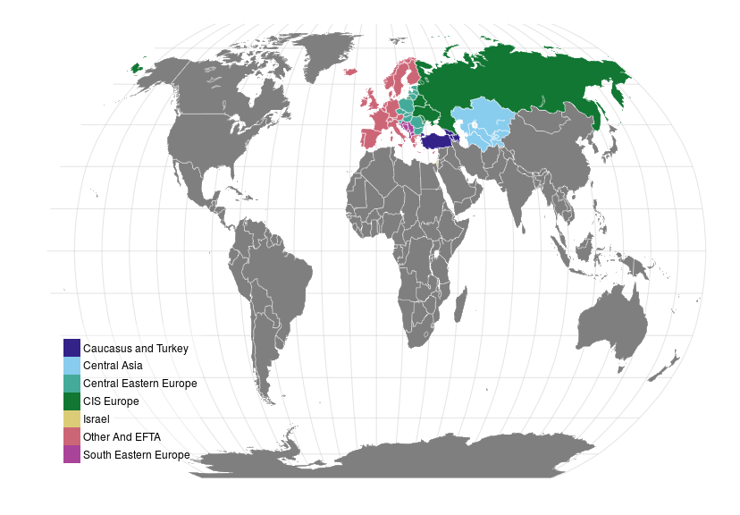

#  Europe and Central Asia

## Map

 

<!-- html table generated in R 3.2.2 by xtable 1.7-4 package -->
<!-- Fri Oct 30 13:16:24 2015 -->
<table class="table table-striped table-hover">
<tr> <th> Caucasus and Turkey </th> <th> Central Asia </th> <th> Central Eastern Europe </th> <th> CIS Europe </th> <th> Israel </th> <th> Other And EFTA </th> <th> South Eastern Europe </th>  </tr>
 <tr> <td> Armenia </td> <td> Kazakhstan </td> <td> Bulgaria </td> <td> Belarus </td> <td> Israel </td> <td> Austria </td> <td> Albania </td> </tr>
  <tr> <td> Azerbaijan </td> <td> Kyrgyzstan </td> <td> Czech Republic </td> <td> Republic of
Moldova </td> <td>  </td> <td> Belgium </td> <td> Bosnia and
Herzegovina </td> </tr>
  <tr> <td> Georgia </td> <td> Tajikistan </td> <td> Estonia </td> <td> Russian Federation </td> <td>  </td> <td> Cyprus </td> <td> Croatia </td> </tr>
  <tr> <td> Turkey </td> <td> Turkmenistan </td> <td> Hungary </td> <td> Ukraine </td> <td>  </td> <td> Denmark </td> <td> Macedonia </td> </tr>
  <tr> <td>  </td> <td> Uzbekistan </td> <td> Latvia </td> <td>  </td> <td>  </td> <td> Finland </td> <td> Montenegro </td> </tr>
  <tr> <td>  </td> <td>  </td> <td> Lithuania </td> <td>  </td> <td>  </td> <td> France </td> <td> Serbia </td> </tr>
  <tr> <td>  </td> <td>  </td> <td> Poland </td> <td>  </td> <td>  </td> <td> Germany </td> <td>  </td> </tr>
  <tr> <td>  </td> <td>  </td> <td> Romania </td> <td>  </td> <td>  </td> <td> Greece </td> <td>  </td> </tr>
  <tr> <td>  </td> <td>  </td> <td> Slovakia </td> <td>  </td> <td>  </td> <td> Iceland </td> <td>  </td> </tr>
  <tr> <td>  </td> <td>  </td> <td> Slovenia </td> <td>  </td> <td>  </td> <td> Ireland </td> <td>  </td> </tr>
  <tr> <td>  </td> <td>  </td> <td>  </td> <td>  </td> <td>  </td> <td> Italy </td> <td>  </td> </tr>
  <tr> <td>  </td> <td>  </td> <td>  </td> <td>  </td> <td>  </td> <td> Luxembourg </td> <td>  </td> </tr>
  <tr> <td>  </td> <td>  </td> <td>  </td> <td>  </td> <td>  </td> <td> Netherlands </td> <td>  </td> </tr>
  <tr> <td>  </td> <td>  </td> <td>  </td> <td>  </td> <td>  </td> <td> Norway </td> <td>  </td> </tr>
  <tr> <td>  </td> <td>  </td> <td>  </td> <td>  </td> <td>  </td> <td> Portugal </td> <td>  </td> </tr>
  <tr> <td>  </td> <td>  </td> <td>  </td> <td>  </td> <td>  </td> <td> Spain </td> <td>  </td> </tr>
  <tr> <td>  </td> <td>  </td> <td>  </td> <td>  </td> <td>  </td> <td> Sweden </td> <td>  </td> </tr>
  <tr> <td>  </td> <td>  </td> <td>  </td> <td>  </td> <td>  </td> <td> Switzerland </td> <td>  </td> </tr>
  <tr> <td>  </td> <td>  </td> <td>  </td> <td>  </td> <td>  </td> <td> United Kingdom </td> <td>  </td> </tr>
  </table>

