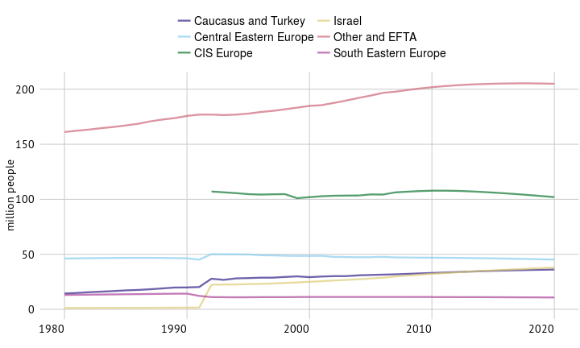
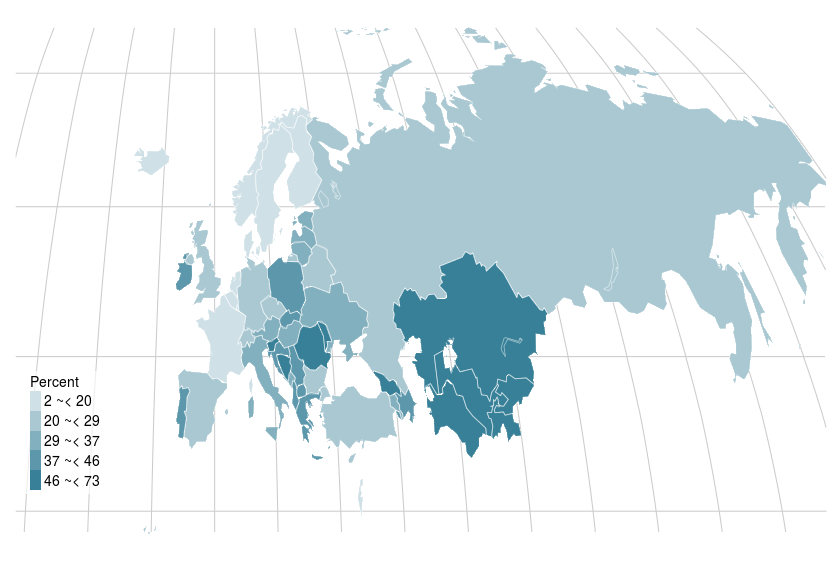

#  Europe and Central Asia

<!-- %
% PPPPPPPPPPPPPPPPP                                               tttt            1111111
% P::::::::::::::::P                                           ttt:::t           1::::::1
% P::::::PPPPPP:::::P                                          t:::::t          1:::::::1
% PP:::::P     P:::::P                                         t:::::t          111:::::1
%   P::::P     P:::::Paaaaaaaaaaaaa  rrrrr   rrrrrrrrr   ttttttt:::::ttttttt       1::::1
%   P::::P     P:::::Pa::::::::::::a r::::rrr:::::::::r  t:::::::::::::::::t       1::::1
%   P::::PPPPPP:::::P aaaaaaaaa:::::ar:::::::::::::::::r t:::::::::::::::::t       1::::1
%   P:::::::::::::PP           a::::arr::::::rrrrr::::::rtttttt:::::::tttttt       1::::l
%   P::::PPPPPPPPP      aaaaaaa:::::a r:::::r     r:::::r      t:::::t             1::::l
%   P::::P            aa::::::::::::a r:::::r     rrrrrrr      t:::::t             1::::l
%   P::::P           a::::aaaa::::::a r:::::r                  t:::::t             1::::l
%   P::::P          a::::a    a:::::a r:::::r                  t:::::t    tttttt   1::::l
% PP::::::PP        a::::a    a:::::a r:::::r                  t::::::tttt:::::t111::::::111
% P::::::::P        a:::::aaaa::::::a r:::::r                  tt::::::::::::::t1::::::::::1
% P::::::::P         a::::::::::aa:::ar:::::r                    tt:::::::::::tt1::::::::::1
% PPPPPPPPPP          aaaaaaaaaa  aaaarrrrrrr                      ttttttttttt  111111111111 -->

<!-- %    ___                                  _ -->
<!-- %   / _ \  __   __   ___   _ __  __   __ (_)   ___  __      __ -->
<!-- %  | | | | \ \ / /  / _ \ | '__| \ \ / / | |  / _ \ \ \ /\ / / -->
<!-- %  | |_| |  \ V /  |  __/ | |     \ V /  | | |  __/  \ V  V / -->
<!-- %   \___/    \_/    \___| |_|      \_/   |_|  \___|   \_/\_/ -->
<!-- % -->

<h1> Overview </h1> 

A combination of declining mortality rates, prolonged life expectancy and younger populations in regions with high fertility contributes to population growth in the world. While growth rates have been slowing since the late 1960s, the world’s population has nevertheless doubled since then, to over 7 billion people. Population growth is generally highest where income levels are low. This is especially true in cities. Since 2008, there have been more people living in cities than in rural areas.
 

 \footnotesize{\textit{Data after 2015 are projections}}\vspace{1mm}  
Europe and Central Asia rural and urban population (1985 to 2016)

   
Population, average annual growth (2004-2014)

   
Life expectancy at birth, countries with the highest and lowest values (2013)

   
Total economically active population (2000 to 2014)

   
Rural population, share of total population (2014)

<!-- %   _____
%  | ____|   ___    ___    _ __     ___    _ __ ___    _   _
%  |  _|    / __|  / _ \  | '_ \   / _ \  | '_ ` _ \  | | | |
%  | |___  | (__  | (_) | | | | | | (_) | | | | | | | | |_| |
%  |_____|  \___|  \___/  |_| |_|  \___/  |_| |_| |_|  \__, |
%                                                      |___/
% -->

<h1> Economy </h1> 

While some sectors have been hard hit, agriculture has demonstrated resilience during the recent economic downturn.  Changes in the wider economy, including growing global integration, affect the performance of the agriculture sector.  Higher overall economic growth also raises consumers’ incomes and hence food demand. Changing interest rates influence capital investments, land values and storage levels, while inflation affects input prices, revenues and credit costs. Fluctuations in exchange rates have an important bearing on international competitiveness and trade flows.
 

   
Value added in agriculture, industry and services, share of GDP (2013)

   
Agriculture value added per worker, countries with the highest values (2003-2013*)

   
Value added in agriculture, average annual growth (2003-2013)

   
Value added in agriculture as share of GDP

   
Value added in agriculture, share of GDP (percent, 2010 to 2013*)

<!-- %   _               _
%  | |       __ _  | |__     ___    _   _   _ __
%  | |      / _` | | '_ \   / _ \  | | | | | '__|
%  | |___  | (_| | | |_) | | (_) | | |_| | | |
%  |_____|  \__,_| |_.__/   \___/   \__,_| |_|
% -->

<h1> Labour </h1> 

A strong labour market is the foundation of sustained well-being and economic growth, inclusion and social cohesion. Therefore access to safe, productive and remunerated work is essential. Yet many workers, especially the most vulnerable, do not enter into formal wage employment but are instead self-employed or participate in unpaid family work, such as in agriculture. This is especially the case with subsistence farming. As a large share of the working poor are involved in agriculture, developments in this sector have a major impact on welfare.
 

   
Labour force participation rate by gender, ages 15+ (2013)

   
Female employment in agriculture, share of female employment (percent 2003-2013*)

   
Male employment in agriculture, share of Male employment (percent 2003 - 2013*)

   
Female employment in agriculture, share of female employment (2000-2014)

   
Employment in agriculture, share of total employment (percent, 2007 to 2012*)

<!-- %   ___                           _
%  |_ _|  _ __    _ __    _   _  | |_   ___
%   | |  | '_ \  | '_ \  | | | | | __| / __|
%   | |  | | | | | |_) | | |_| | | |_  \__ \
%  |___| |_| |_| | .__/   \__,_|  \__| |___/
%                |_|
% -->

<h1> Inputs </h1> 

Adequate access to inputs, including land, pesticides and fertilizers, is vital for agricultural production and growth. Throughout Asia and in parts of Latin America, expanding seed and fertilizer use has been accompanied by investments in irrigation, rural roads, marketing infrastructure and financial services, paving the way for dynamic commercial input markets. In other regions, such as sub-Saharan Africa, the uptake of agricultural inputs is relatively low because it is often cheaper to expand cropland to have higher production.
 

   
Fertilizer consumption in nutrients per ha of arable land (2002 to 2012)

   
Nitrogen fertilizers consumption in nutrients per ha of arable land (2012)

   
Phosphate fertilizers consumption in nutrients per ha of arable land (2012)

   
Fertilizer consumption in nutrients per ha of arable land (2012)

   
Pesticides per ha of arable land (kg/ha, 2007 to 2012*)

<!-- %   ___                                _                                _
%  |_ _|  _ __   __   __   ___   ___  | |_   _ __ ___     ___   _ __   | |_
%   | |  | '_ \  \ \ / /  / _ \ / __| | __| | '_ ` _ \   / _ \ | '_ \  | __|
%   | |  | | | |  \ V /  |  __/ \__ \ | |_  | | | | | | |  __/ | | | | | |_
%  |___| |_| |_|   \_/    \___| |___/  \__| |_| |_| |_|  \___| |_| |_|  \__|
% -->

<h1> Investments </h1> 

Investing in agriculture is one of the most effective strategies for reducing poverty and hunger, and promoting sustainability. The regions of the world where hunger and extreme poverty are most widespread today – South Asia and sub-Saharan Africa – have seen flat or declining rates of investment per worker in agriculture over the past thirty years. Farmers tend to be the largest investors in developing country agriculture, and therefore their investment decisions are paramount for any strategy aimed at improving agricultural investment.
 

   
Aid flows to agriculture, share of total aid (1995-2013) - NO COUNTRY LEVEL DATA???

   
Total credit to agriculture, top 20 countries in 2014 (2000 and 2012)

   
Agri-Orientation Index, highest and lowest values (average 2008-2012)

   
Aid flows to agriculture, broad (1995-2013) - NO COUNTRY LEVEL DATA???

   
Share of government expenditure on agriculture, share of total outlays (percent, 2008 to 2012*)

