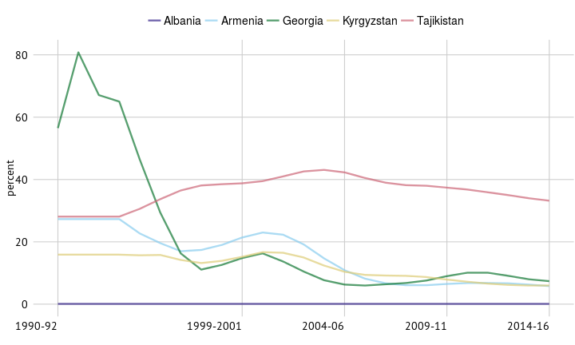
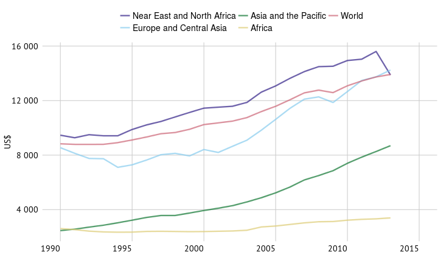
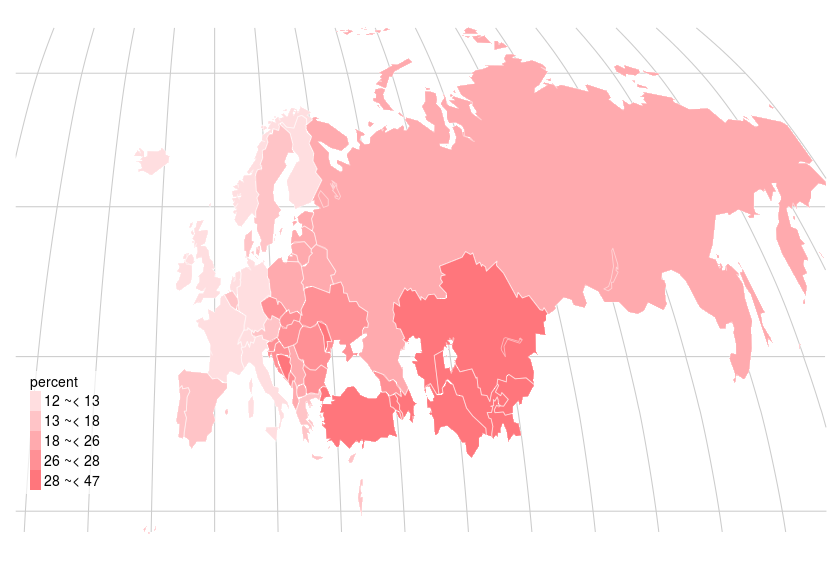

#  Europe and Central Asia

<!--
%
% PPPPPPPPPPPPPPPPP                                               tttt           222222222222222
% P::::::::::::::::P                                           ttt:::t          2:::::::::::::::22
% P::::::PPPPPP:::::P                                          t:::::t          2::::::222222:::::2
% PP:::::P     P:::::P                                         t:::::t          2222222     2:::::2
%   P::::P     P:::::Paaaaaaaaaaaaa  rrrrr   rrrrrrrrr   ttttttt:::::ttttttt                2:::::2
%   P::::P     P:::::Pa::::::::::::a r::::rrr:::::::::r  t:::::::::::::::::t                2:::::2
%   P::::PPPPPP:::::P aaaaaaaaa:::::ar:::::::::::::::::r t:::::::::::::::::t             2222::::2
%   P:::::::::::::PP           a::::arr::::::rrrrr::::::rtttttt:::::::tttttt        22222::::::22
%   P::::PPPPPPPPP      aaaaaaa:::::a r:::::r     r:::::r      t:::::t            22::::::::222
%   P::::P            aa::::::::::::a r:::::r     rrrrrrr      t:::::t           2:::::22222
%   P::::P           a::::aaaa::::::a r:::::r                  t:::::t          2:::::2
%   P::::P          a::::a    a:::::a r:::::r                  t:::::t    tttttt2:::::2
% PP::::::PP        a::::a    a:::::a r:::::r                  t::::::tttt:::::t2:::::2       222222
% P::::::::P        a:::::aaaa::::::a r:::::r                  tt::::::::::::::t2::::::2222222:::::2
% P::::::::P         a::::::::::aa:::ar:::::r                    tt:::::::::::tt2::::::::::::::::::2
% PPPPPPPPPP          aaaaaaaaaa  aaaarrrrrrr                      ttttttttttt  22222222222222222222
%

%%%%%%%%%%%%%%%%%%%%%%%%%%%%%%%%%%%%%%%%%%%%%%%%%%
%% PART2 - Hunger dimensions
%%%%%%%%%%%%%%%%%%%%%%%%%%%%%%%%%%%%%%%%%%%%%%%%%%
 -->

<!-- %   _   _             _                                         _       _                              _
%  | | | | _ __    __| |  ___  _ __  _ __    ___   _   _  _ __ (_) ___ | |__   _ __ ___    ___  _ __  | |_
%  | | | || '_ \  / _` | / _ \| '__|| '_ \  / _ \ | | | || '__|| |/ __|| '_ \ | '_ ` _ \  / _ \| '_ \ | __|
%  | |_| || | | || (_| ||  __/| |   | | | || (_) || |_| || |   | |\__ \| | | || | | | | ||  __/| | | || |_
%   \___/ |_| |_| \__,_| \___||_|   |_| |_| \___/  \__,_||_|   |_||___/|_| |_||_| |_| |_| \___||_| |_| \__|
 -->

<h1> Undernourishment </h1> 

Undernourishment is a state, lasting for at least one year, of inability to acquire enough food, defined as a level of food intake insufficient to meet dietary energy requirements. About 795 million people – just over one in every nine people – in the world still lack sufficient food for conducting an active and healthy life. Yet progress has been made, even in the presence of significant population growth. Two hundred and sixteen million million fewer people suffer from undernourishment than 25 years ago and 167 million fewer than a decade ago.
 

<!-- html table generated in R 3.2.2 by xtable 1.7-4 package -->
<!-- Fri Oct 30 13:16:40 2015 -->
<table class="table table-striped table-hover">
<caption align="top"> \large{Prevalence of undernourishment (percent)} </caption>
<tr> <th>  </th> <th> 1990-92 </th> <th> 2014-16 </th>  </tr>
 <tr> <td> Africa </td> <td align="right"> 33 </td> <td align="right"> 23 </td> </tr>
  <tr> <td> Asia and the Pacific </td> <td align="right"> 24 </td> <td align="right"> 12.3 </td> </tr>
  <tr> <td> Europe and Central Asia </td> <td align="right"> 8 </td> <td align="right"> 0.1 </td> </tr>
  <tr> <td> Near East and North Africa </td> <td align="right"> 7 </td> <td align="right"> 7.5 </td> </tr>
  <tr> <td> World </td> <td align="right"> 19 </td> <td align="right"> 10.8 </td> </tr>
  </table>
  
Share of government expenditure on agriculture, share of total outlays (percent, 2008 to 2012*)

   
Countries with the highest number of undernourished in 2014-16

   
European countries with the highest number of undernourished in 2014-16

   
Prevalence of undernourishment, top 5 countries

   
Prevalence of undernourishment (percent, 2014-16)

<!-- %   _____                       _                             _   _           _       _   _   _   _
%  |  ___|   ___     ___     __| |     __ _  __   __   __ _  (_) | |   __ _  | |__   (_) | | (_) | |_   _   _
%  | |_     / _ \   / _ \   / _` |    / _` | \ \ / /  / _` | | | | |  / _` | | '_ \  | | | | | | | __| | | | |
%  |  _|   | (_) | | (_) | | (_| |   | (_| |  \ V /  | (_| | | | | | | (_| | | |_) | | | | | | | | |_  | |_| |
%  |_|      \___/   \___/   \__,_|    \__,_|   \_/    \__,_| |_| |_|  \__,_| |_.__/  |_| |_| |_|  \__|  \__, |
%                                                                                                       |___/ -->

<h1> Food availability </h1> 

Availability is an important dimension of food security. Supplying enough food to the reference population is a necessary, but insufficient, condition for ensuring adequate access for individuals. Over recent decades, trends in food production per capita have been generally positive across most regions. However, growth rates in Africa have been lower for the last 20 years, despite notable exceptions. In most countries and regions, high food availability is associated with relatively low prevalence of undernourishment. However, outcome indicators show that high food availability does not always guarantee high food security.
 

   
Average dietary energy supply adequacy, 3 year average (1990 to 2015)

   
Energy supply derived from cereals, roots and tubers, top 6 European countries in 2009-2011

   
Average protein supply, top 6 European countries in 2009-2011

   
Average supply of protein of animal origin

   
Average value of food production, constant 2004-2006 I\$ per person (3 year average, 2011-13)

<!-- %   _____                       _
%  |  ___|   ___     ___     __| |     __ _    ___    ___    ___   ___   ___
%  | |_     / _ \   / _ \   / _` |    / _` |  / __|  / __|  / _ \ / __| / __|
%  |  _|   | (_) | | (_) | | (_| |   | (_| | | (__  | (__  |  __/ \__ \ \__ \
%  |_|      \___/   \___/   \__,_|    \__,_|  \___|  \___|  \___| |___/ |___/
% -->

<h1> Food access </h1> 

An adequate supply of food does not in itself guarantee household level food security. Access to food is primarily determined by incomes, food prices and the ability of households and individuals to obtain access to social support. Individuals’ access to food is also heavily influenced by social variables, including gender positioning and power hierarchies within households. In addition to economic affordability, physical access to food is also facilitated by adequate infrastructure, such as railway lines and paved roads.
 

   
Depth of food decifit (kcal/capita/day) (3 year averages)

   
Domestic food price level index, top 20 countries in 2014 (2000 to 2014)

   
Prevalence of undernourishment, highest 20 countries in 2014-16 (3 year averages)

   
GDP per capita, PPP, constant 2011 international \$

   
Road density, per 100 km\textsuperscript{2} of land area (2007 to 2011*)

<!-- %   _____                       _           _             _       _   _   _   _
%  |  ___|   ___     ___     __| |    ___  | |_    __ _  | |__   (_) | | (_) | |_   _   _
%  | |_     / _ \   / _ \   / _` |   / __| | __|  / _` | | '_ \  | | | | | | | __| | | | |
%  |  _|   | (_) | | (_) | | (_| |   \__ \ | |_  | (_| | | |_) | | | | | | | | |_  | |_| |
%  |_|      \___/   \___/   \__,_|   |___/  \__|  \__,_| |_.__/  |_| |_| |_|  \__|  \__, |
%                                                                                   |___/ -->

<h1> Economic and political stability </h1> 

Over the last ten years, food and agricultural markets have entered an unexpectedly turbulent phase, characterized by large supply shortfalls, price swings. Political and economic uncertainties, coupled with extreme weather conditions, can have direct and adverse impacts on food security. The poorer the household, the stronger the impact of external shocks, as poor households spend a proportionally higher share of their incomes on food.
 

   
Per capita food production variability, constant 2004-2006 thousand international \$

   
Per capita food supply variability, top 20 countries in 2011, kcal/capita/day

   
Domestic food price volatility index, top 20 countriesin 2014

   
Value of food imports as a share of total merchandise exports (3 year averages)

   
Political stability and absence of violence/terrorism, index (2013)

<!-- %   _____                       _             _     _   _   _                 _     _
%  |  ___|   ___     ___     __| |    _   _  | |_  (_) | | (_)  ____   __ _  | |_  (_)   ___    _ __
%  | |_     / _ \   / _ \   / _` |   | | | | | __| | | | | | | |_  /  / _` | | __| | |  / _ \  | '_ \
%  |  _|   | (_) | | (_) | | (_| |   | |_| | | |_  | | | | | |  / /  | (_| | | |_  | | | (_) | | | | |
%  |_|      \___/   \___/   \__,_|    \__,_|  \__| |_| |_| |_| /___|  \__,_|  \__| |_|  \___/  |_| |_|
% -->

<h1> Food utilization </h1> 

Utilization emphasizes the nutritional aspects of food security. It is commonly understood as the way the body makes the most of nutrients from food. Sufficient energy and nutrient intake includes nutritious and safe diets, a clean environment, access to health care, diversity of a diet and intra-household distribution of food. Poor utilization within a population can impose economic and social costs in countries at all economic levels.
 

<!-- html table generated in R 3.2.2 by xtable 1.7-4 package -->
<!-- Fri Oct 30 13:16:47 2015 -->
<table class="table table-striped table-hover">
<caption align="top"> \large{Countries with highest share of children under 5 who are underweight}, percent </caption>
<tr> <th>  </th> <th> Year </th> <th> % </th>  </tr>
 <tr> <td> Tajikistan </td> <td align="right"> 2012 </td> <td align="right"> 13.3 </td> </tr>
  <tr> <td> Albania </td> <td align="right"> 2009 </td> <td align="right"> 6.3 </td> </tr>
  <tr> <td> Armenia </td> <td align="right"> 2010 </td> <td align="right"> 5.3 </td> </tr>
  <tr> <td> Kazakhstan </td> <td align="right"> 2010 </td> <td align="right"> 3.7 </td> </tr>
  <tr> <td> Kyrgyzstan </td> <td align="right"> 2014 </td> <td align="right"> 2.8 </td> </tr>
  </table>
  
Political stability and absence of violence/terrorism, index (2013)

   
Percentage of children under 5 who are stunted, highest 20 countries (2006 - 2014*)

   
Percentage of children under 5 affected by wasting, highest 20 countries (2006 - 2014*)

   
Access to improved water source and sanitation facilities

   
Percentage of anaemia among children under 5, percent (2011)

