#  Europe and Central Asia

<!--
%
% PPPPPPPPPPPPPPPPP                                               tttt           333333333333333
% P::::::::::::::::P                                           ttt:::t          3:::::::::::::::33
% P::::::PPPPPP:::::P                                          t:::::t          3::::::33333::::::3
% PP:::::P     P:::::P                                         t:::::t          3333333     3:::::3
%   P::::P     P:::::Paaaaaaaaaaaaa  rrrrr   rrrrrrrrr   ttttttt:::::ttttttt                3:::::3
%   P::::P     P:::::Pa::::::::::::a r::::rrr:::::::::r  t:::::::::::::::::t                3:::::3
%   P::::PPPPPP:::::P aaaaaaaaa:::::ar:::::::::::::::::r t:::::::::::::::::t        33333333:::::3
%   P:::::::::::::PP           a::::arr::::::rrrrr::::::rtttttt:::::::tttttt        3:::::::::::3
%   P::::PPPPPPPPP      aaaaaaa:::::a r:::::r     r:::::r      t:::::t              33333333:::::3
%   P::::P            aa::::::::::::a r:::::r     rrrrrrr      t:::::t                      3:::::3
%   P::::P           a::::aaaa::::::a r:::::r                  t:::::t                      3:::::3
%   P::::P          a::::a    a:::::a r:::::r                  t:::::t    tttttt            3:::::3
% PP::::::PP        a::::a    a:::::a r:::::r                  t::::::tttt:::::t3333333     3:::::3
% P::::::::P        a:::::aaaa::::::a r:::::r                  tt::::::::::::::t3::::::33333::::::3
% P::::::::P         a::::::::::aa:::ar:::::r                    tt:::::::::::tt3:::::::::::::::33
% PPPPPPPPPP          aaaaaaaaaa  aaaarrrrrrr                      ttttttttttt   333333333333333
%

%%%%%%%%%%%%%%%%%%%%%%%%%%%%%%%%%%%%%%%%%%%%%%%%%%
%% PART3 - Food Supply
%%%%%%%%%%%%%%%%%%%%%%%%%%%%%%%%%%%%%%%%%%%%%%%%%% -->

<!--
%   ____   _        _                                                                                         _
%  |  _ \ (_)  ___ | |_  __ _  _ __  _   _    ___  _ __    ___  _ __  __ _  _   _   ___  _   _  _ __   _ __  | | _   _
%  | | | || | / _ \| __|/ _` || '__|| | | |  / _ \| '_ \  / _ \| '__|/ _` || | | | / __|| | | || '_ \ | '_ \ | || | | |
%  | |_| || ||  __/| |_| (_| || |   | |_| | |  __/| | | ||  __/| |  | (_| || |_| | \__ \| |_| || |_) || |_) || || |_| |
%  |____/ |_| \___| \__|\__,_||_|    \__, |  \___||_| |_| \___||_|   \__, | \__, | |___/ \__,_|| .__/ | .__/ |_| \__, |
%                                    |___/                           |___/  |___/              |_|    |_|        |___/ -->

<h1> Dietary energy supply </h1> 

The dietary energy supply (DES) is the food available for human consumption, expressed in kilocalories per person per day. At the country level, it is calculated as a measure of food available for human use after taking out all non-food utilization, including exports, industrial use, animal feed, seed, wastage and changes in stocks. In 1961 the average global calorie availability was as low as 2 196 kcal/cap/day; by 2011, it had reached 2 870 kcal/cap/day, and was centered more around a narrow base of staple grains as well as meat and dairy products.
 

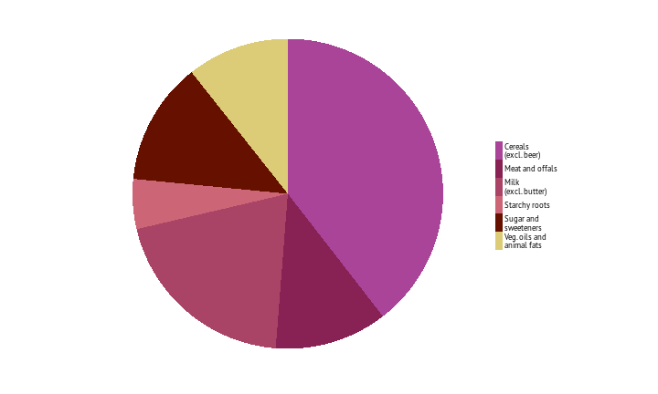   
Share of dietary energy supply, kcal/capita/day (2009-2011)

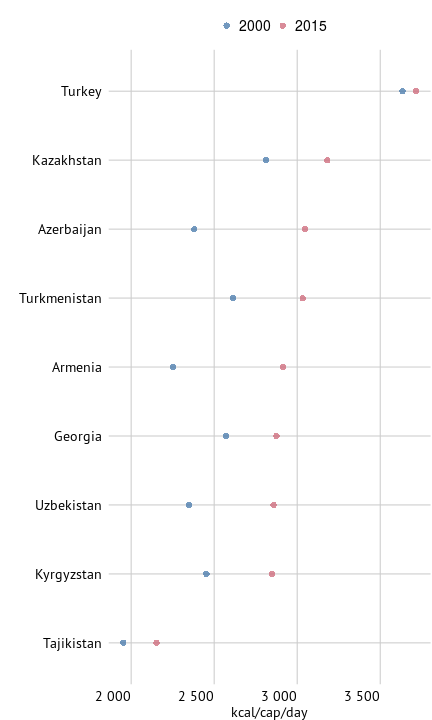   
Dietary energy supply, top 20 countries in 2015

   
Dietary energy supply, bottom 20 countries in 2015

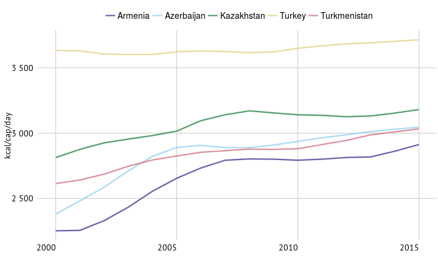   
Dietary energy supply in top 5 countries

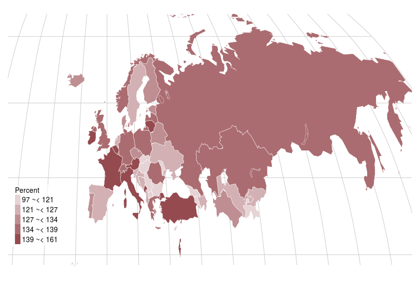   
Average dietary energy supply adequacy, percent (2014-2016)

<!--
%    ____                                             _               _    _
%   / ___| _ __  ___   _ __    _ __   _ __  ___    __| | _   _   ___ | |_ (_)  ___   _ __
%  | |    | '__|/ _ \ | '_ \  | '_ \ | '__|/ _ \  / _` || | | | / __|| __|| | / _ \ | '_ \
%  | |___ | |  | (_) || |_) | | |_) || |  | (_) || (_| || |_| || (__ | |_ | || (_) || | | |
%   \____||_|   \___/ | .__/  | .__/ |_|   \___/  \__,_| \__,_| \___| \__||_| \___/ |_| |_|
%                     |_|     |_|
% -->

<h1> Crop production </h1> 

The majority of people in developing countries live in rural areas, and most of them depend on agriculture for their livelihoods. Over the past 50 years, growth in crop production has been driven largely by higher yields per unit of land, and crop intensification. Trends are not uniform across regions, however. Most of the growth in wheat and rice production in Asia and Northern Africa has been from gains in yield, while expansion of harvested land has led to production growth of maize in Latin America and in sub-Saharan Africa.
 

<!-- html table generated in R 3.2.2 by xtable 1.7-4 package -->
<!-- Fri Oct 30 13:16:52 2015 -->
<table class="table table-striped table-hover">
<caption align="top"> \large{Fastest growing products based on quantities (average anual growth rate, 2000 to 2013)} </caption>
<tr> <th>  </th> <th> % </th>  </tr>
 <tr> <td> Rapeseed </td> <td align="right"> 14 </td> </tr>
  <tr> <td> Pyrethrum, dried </td> <td align="right"> 9 </td> </tr>
  <tr> <td> Hempseed </td> <td align="right"> 9 </td> </tr>
  <tr> <td> Taro (cocoyam) </td> <td align="right"> 7 </td> </tr>
  <tr> <td> Vanilla </td> <td align="right"> 7 </td> </tr>
  </table>
  
Average dietary energy supply adequacy, percent (2014-2016)

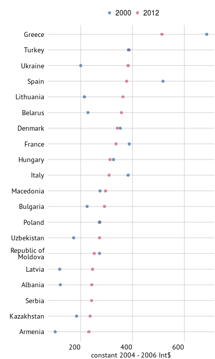   
Top 20 crop producing countries in 2012 based on net per capita crop production value

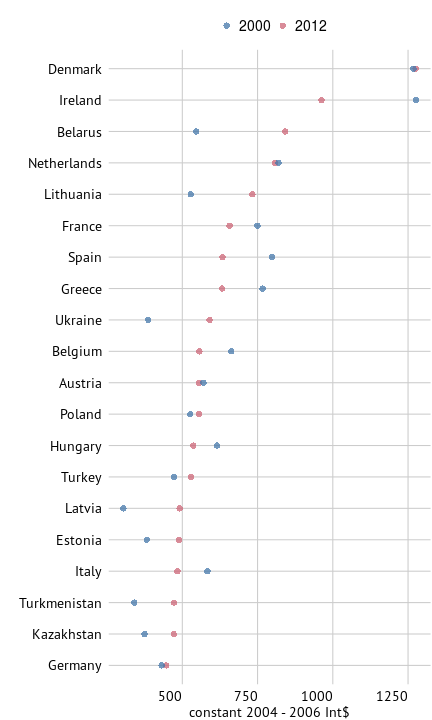   
Top 20 food producing countries in 2012 based on net food per capita production value

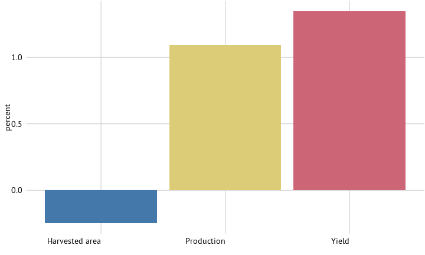   
Average annual growth in cereals production (2000-13)

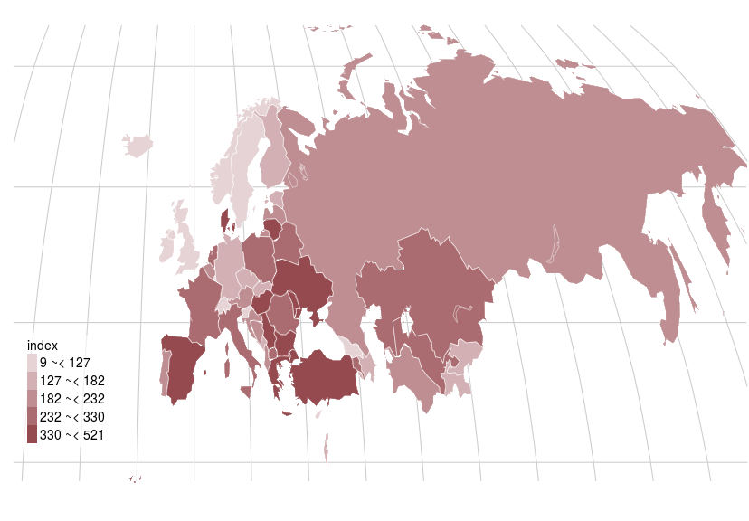   
Crops, gross per capita production index (2004-06 = 100, 2013)

<!-- %
%    ____
%   / ___| _ __  ___   _ __
%  | |    | '__|/ _ \ | '_ \
%  | |___ | |  | (_) || |_) |
%   \____||_|   \___/ | .__/
%                     |_|
% -->

<h1> Crops </h1> 

Cereals, which include wheat, rice, barley, maize, rye, oats and millet, make up the majority of the production of the crop sector. They continue to be the most important food source for human consumption. Yet external factors, such as rising incomes and urbanization, are causing diets to shift towards diets that are higher in protein, fats and sugar. In addition, livestock and biofuel production have and will most likely grow at a faster rate than crop production. This is causing a shift away from crops, like wheat and rice, towards coarse grains and oilseeds to meet demands for food, feed and biofuel.
 

<!-- html table generated in R 3.2.2 by xtable 1.7-4 package -->
<!-- Fri Oct 30 13:16:54 2015 -->
<table class="table table-striped table-hover">
<caption align="top"> \large{Top five items produced in 2013, thousand tonnes} </caption>
<tr> <th>  </th> <th> 2000 </th> <th> 2013 </th>  </tr>
 <tr> <td> Wheat </td> <td align="right"> 221 874 </td> <td align="right"> 273 765 </td> </tr>
  <tr> <td> Sugar beet </td> <td align="right"> 190 058 </td> <td align="right"> 184 924 </td> </tr>
  <tr> <td> Potatoes </td> <td align="right"> 159 918 </td> <td align="right"> 127 851 </td> </tr>
  <tr> <td> Maize </td> <td align="right"> 67 049 </td> <td align="right"> 125 624 </td> </tr>
  <tr> <td> Barley </td> <td align="right"> 94 271 </td> <td align="right"> 98 011 </td> </tr>
  </table>
  
Crops, gross per capita production index (2004-06 = 100, 2013)

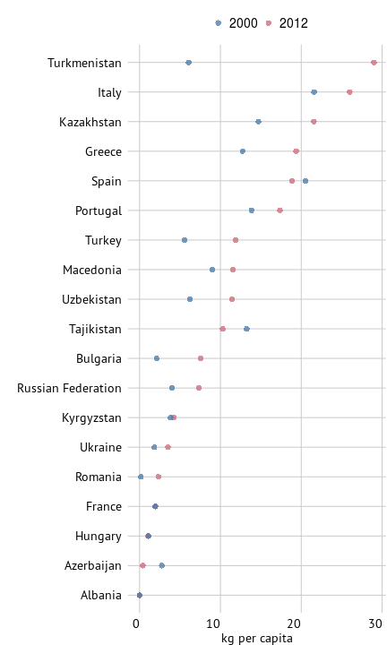   
Top 20 rice producing countries, per capita

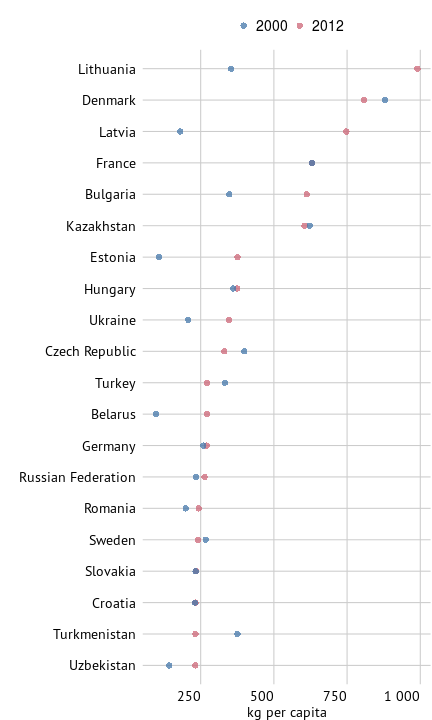   
Top 20 wheat producing countries, per capita

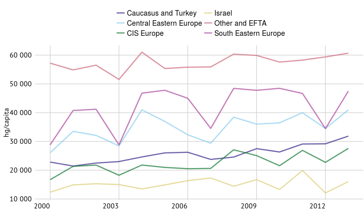   
Cereals, yield

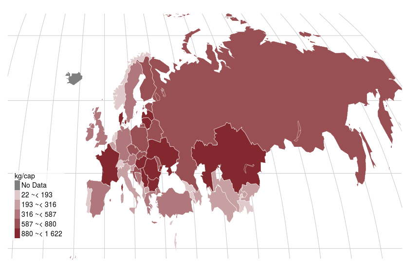   
Cereal production, kg/cap (2013)

<!-- %
%   _      _                   _                _
%  | |    (_)__   __ ___  ___ | |_  ___    ___ | | __
%  | |    | |\ \ / // _ \/ __|| __|/ _ \  / __|| |/ /
%  | |___ | | \ V /|  __/\__ \| |_| (_) || (__ |   <
%  |_____||_|  \_/  \___||___/ \__|\___/  \___||_|\_\
%
% -->

<h1> Livestock </h1> 

The world food economy is being increasingly driven by the shift of diets towards animal-based products such as meat, milk and dairy. As a result, agriculture is being affected, not only through growth of livestock production, but also through linkages to other sectors that supply feeding stuffs, such as crops and fisheries. Globally livestock production is the largest user of agricultural land and therefore also leaves a significant imprint on the environment.
 

<!-- html table generated in R 3.2.2 by xtable 1.7-4 package -->
<!-- Fri Oct 30 13:16:56 2015 -->
<table class="table table-striped table-hover">
<caption align="top"> \large{Live animal production, top 5 in 2013 (thousand heads)} </caption>
<tr> <th>  </th> <th> 2000 </th> <th> 2013 </th>  </tr>
 <tr> <td> Sheep </td> <td align="right"> 212 792 </td> <td align="right"> 218 118 </td> </tr>
  <tr> <td> Pigs </td> <td align="right"> 202 593 </td> <td align="right"> 186 042 </td> </tr>
  <tr> <td> Cattle </td> <td align="right"> 174 356 </td> <td align="right"> 162 259 </td> </tr>
  <tr> <td> Goats </td> <td align="right"> 31 306 </td> <td align="right"> 35 990 </td> </tr>
  <tr> <td> Horses </td> <td align="right"> 8 990 </td> <td align="right"> 8 575 </td> </tr>
  </table>
  
Cereal production, kg/cap (2013)

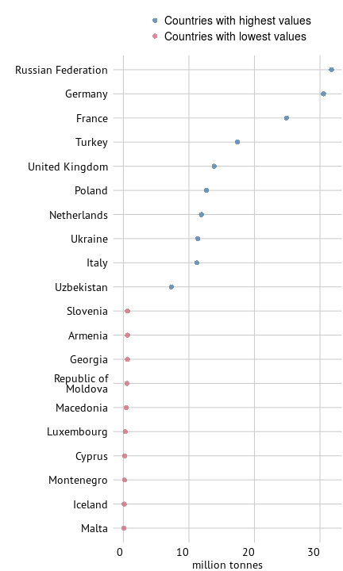   
Total milk production, top and bottom 10 countries (2012)

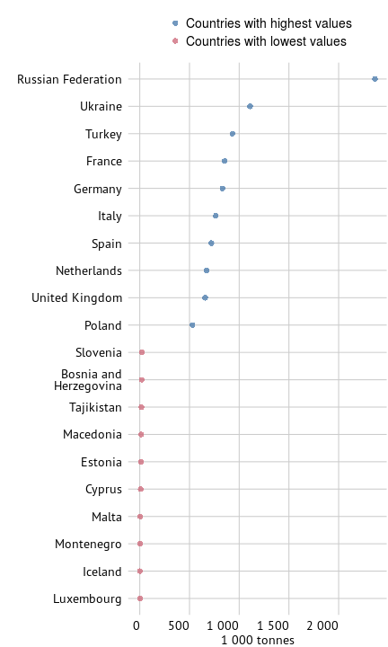   
Total egg production, top and bottom 10 countries (2012)

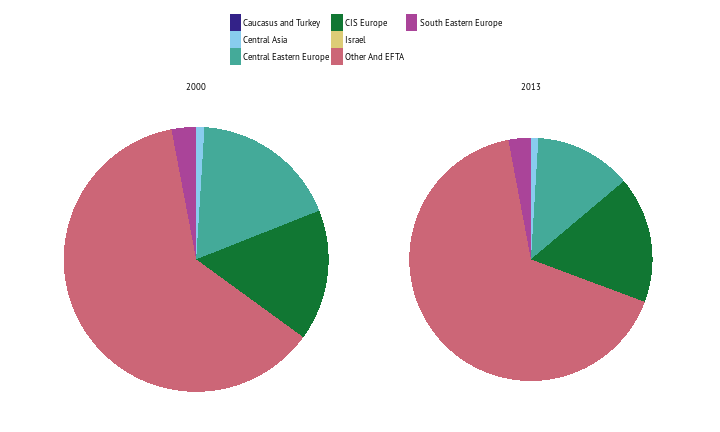   
Pig production (heads)

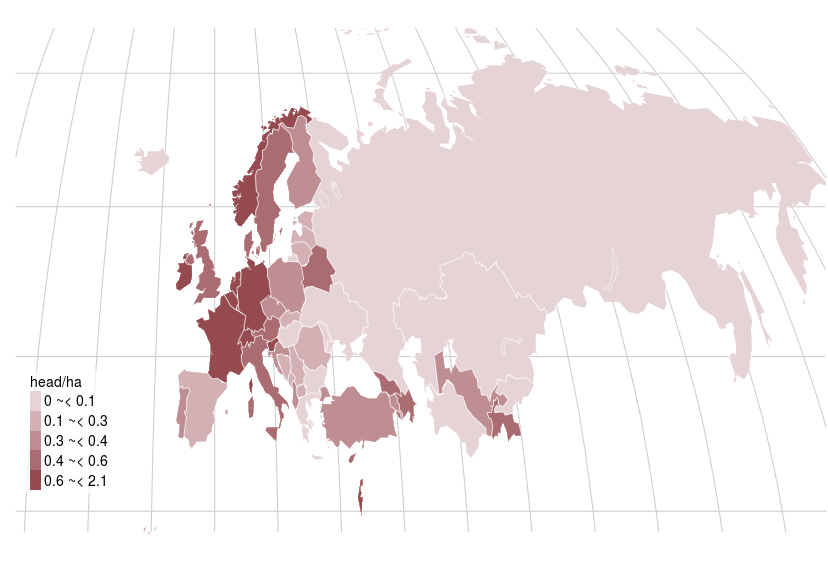   
Cattle and buffaloes per ha of agricultural area, heads per ha (2012)

<!-- %   _____  _       _                  _
%  |  ___|(_) ___ | |__    ___  _ __ (_)  ___  ___
%  | |_   | |/ __|| '_ \  / _ \| '__|| | / _ \/ __|
%  |  _|  | |\__ \| | | ||  __/| |   | ||  __/\__ \
%  |_|    |_||___/|_| |_| \___||_|   |_| \___||___/
% -->

<h1> Fisheries </h1> 

Fish is an important component in people’s diets, providing about 3.1 billion people with almost 20 percent of their average intake of animal protein. Capture fisheries continue to dominate world output, but aquaculture accounts for a growing percentage of total fish supply. Fishery sectors are particularly important in developing countries, providing both food and livelihoods
 

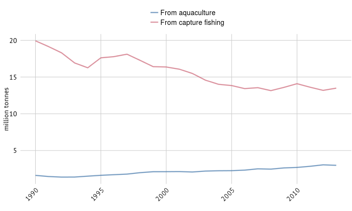   
Fish production for aquaculture and capture fishing

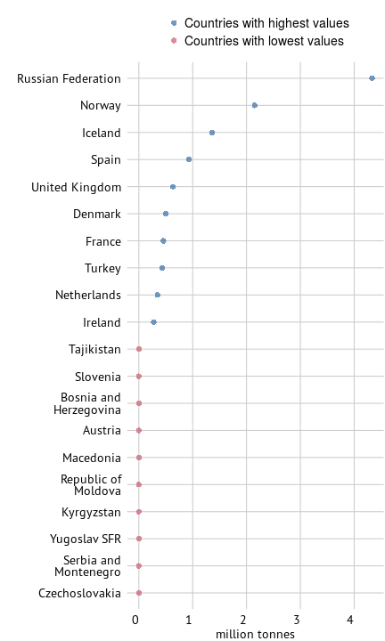   
20 countries with highest value of capture production (2013)

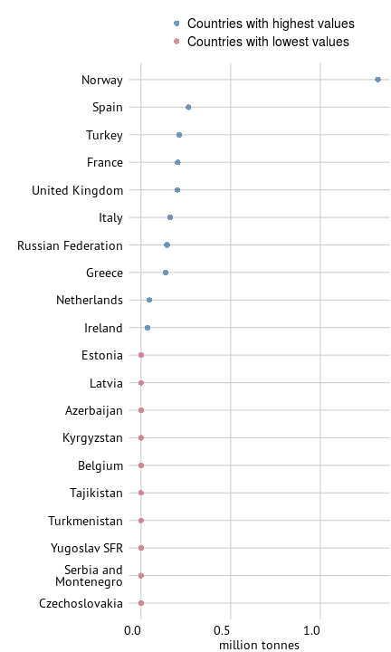   
20 countries with highest value of aquaculture production (2013)

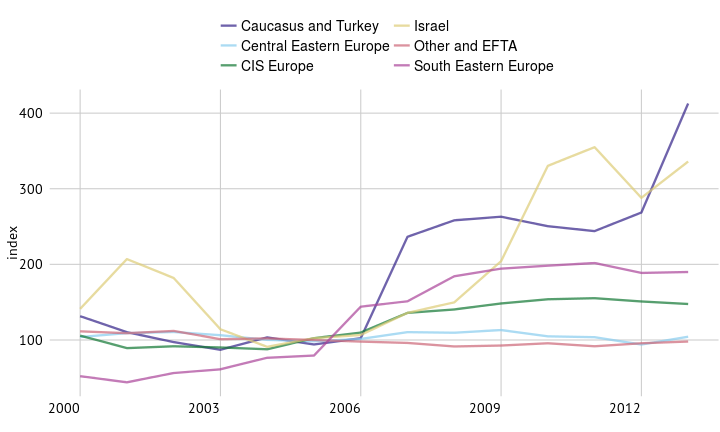   
Fish production indices (2004-06=100)

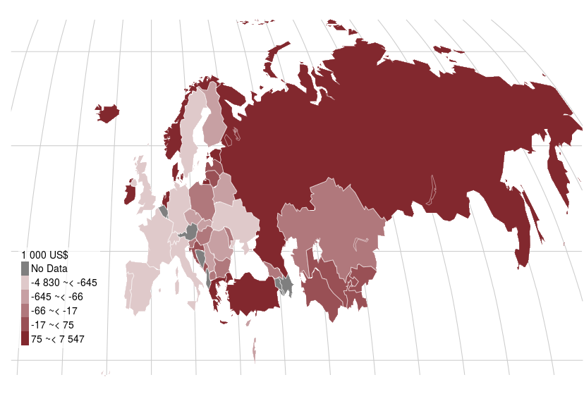   
Net trade of fish in 2012

<!-- %      _                 _               _  _                       _   _                    _
%     / \    __ _  _ __ (_)  ___  _   _ | || |_  _   _  _ __  __ _ | | | |_  _ __  __ _   __| |  ___
%    / _ \  / _` || '__|| | / __|| | | || || __|| | | || '__|/ _` || | | __|| '__|/ _` | / _` | / _ \
%   / ___ \| (_| || |   | || (__ | |_| || || |_ | |_| || |  | (_| || | | |_ | |  | (_| || (_| ||  __/
%  /_/   \_\\__, ||_|   |_| \___| \__,_||_| \__| \__,_||_|   \__,_||_|  \__||_|   \__,_| \__,_| \___|
%           |___/ -->

<h1> Agricultural trade </h1> 

Most of the food consumed worldwide is grown locally. Where there is not enough local production to meet demand, trade has been instrumental in filling the gap. The scale of food and agricultural trade today is unprecedented. In real terms, the value of international flows has increased around fivefold over the past 50 years, reflecting global trends in the overall volume of trade. However, this expansion has been unevenly distributed across regions. High-income countries have generally outpaced developing regions, although several of the latter have comparative advantages in food and agricultural production.
 

<!-- html table generated in R 3.2.2 by xtable 1.7-4 package -->
<!-- Fri Oct 30 13:17:00 2015 -->
<table class="table table-striped table-hover">
<caption align="top"> \large{Exports and Imports of food, million US\$ (2012)} </caption>
<tr> <th>  </th> <th> Export value </th> <th> Import value </th>  </tr>
 <tr> <td> Other and EFTA </td> <td align="right"> 314 </td> <td align="right"> 326 </td> </tr>
  <tr> <td> Central Eastern Europe </td> <td align="right"> 49 </td> <td align="right"> 38 </td> </tr>
  <tr> <td> CIS Europe </td> <td align="right"> 32 </td> <td align="right"> 36 </td> </tr>
  <tr> <td> Caucasus and Turkey </td> <td align="right"> 14 </td> <td align="right"> 10 </td> </tr>
  <tr> <td> Israel </td> <td align="right"> 5 </td> <td align="right"> 10 </td> </tr>
  <tr> <td> South Eastern Europe </td> <td align="right"> 4 </td> <td align="right"> 6 </td> </tr>
  </table>
  
Net trade of fish in 2012

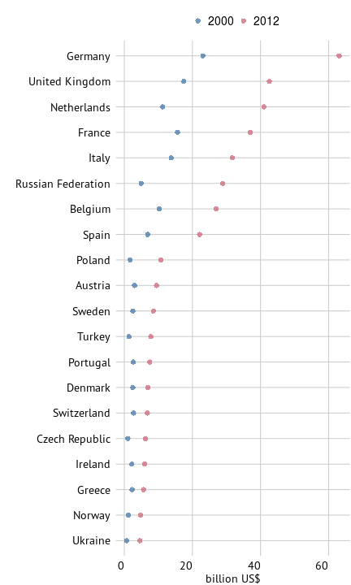   
Top food importing countries in 2012

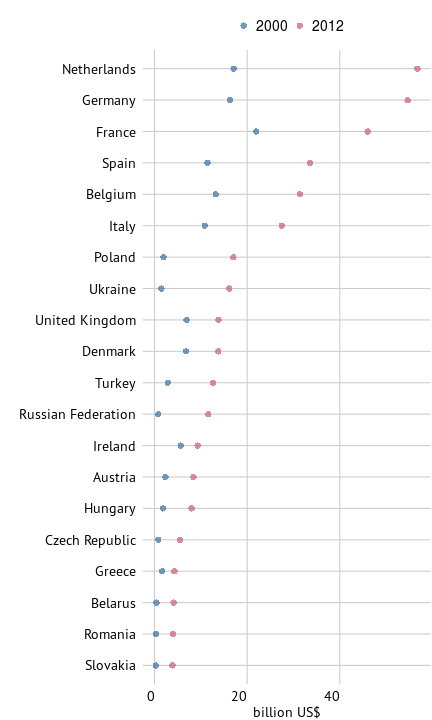   
Top food exporting countries in 2012

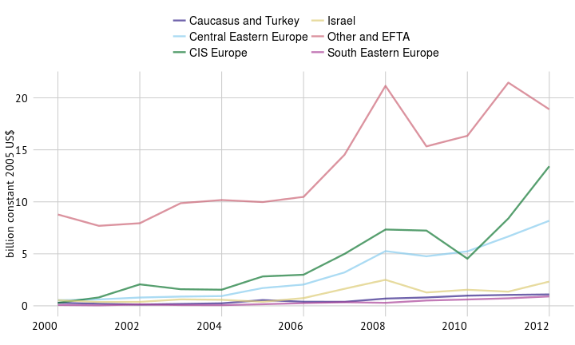   
Cereal exports

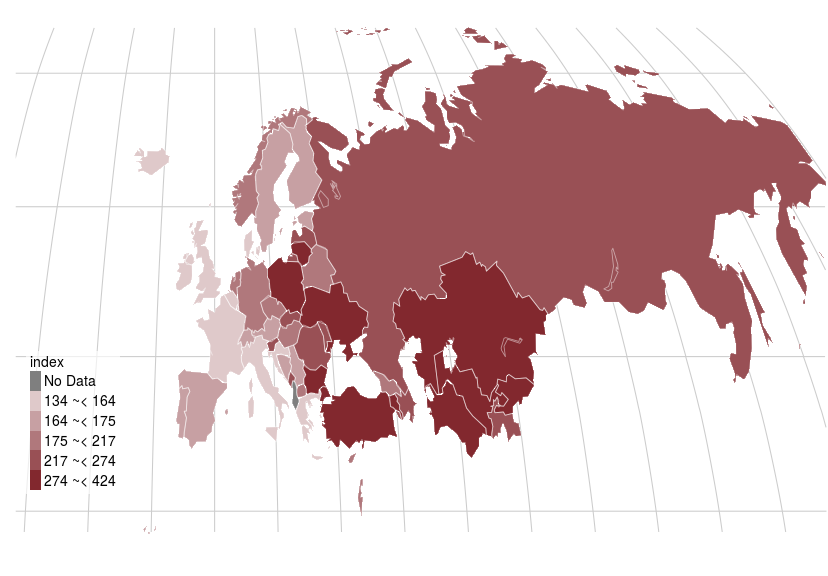   
Import value index (2004-2006 = 100, 2011)

