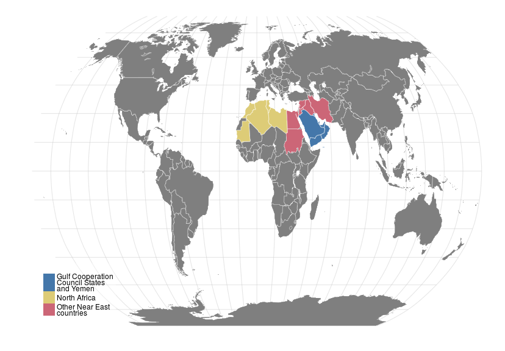

#  North Africa and the Middle East

## Map

 

<!-- html table generated in R 3.2.2 by xtable 1.7-4 package -->
<!-- Fri Oct 30 13:17:10 2015 -->
<table class="table table-striped table-hover">
<tr> <th> Gulf Cooperation
Council States
and Yemen </th> <th> North Africa </th> <th> Other Near East
countries </th>  </tr>
 <tr> <td> Kuwait </td> <td> Algeria </td> <td> Egypt </td> </tr>
  <tr> <td> Oman </td> <td> Libya </td> <td> Iran
(Islamic Republic of) </td> </tr>
  <tr> <td> Qatar </td> <td> Mauritania </td> <td> Iraq </td> </tr>
  <tr> <td> Saudi Arabia </td> <td> Morocco </td> <td> Jordan </td> </tr>
  <tr> <td> United Arab
Emirates </td> <td> Tunisia </td> <td> Lebanon </td> </tr>
  <tr> <td> Yemen </td> <td>  </td> <td> Sudan </td> </tr>
  <tr> <td>  </td> <td>  </td> <td> Syria </td> </tr>
  </table>

